# 成果呈现计划

## 需求

既然需要多媒介展示，那么各个媒介又应该具体如何配合呈现呢？呈现具体表现为，什么样的数据，在什么样的平台下，被什么样的人浏览阅读（自己）。  需要进一步考虑数据结构和呈现方式。

目标是分析一些现有平台的数据格式，进行解构和重构，得到数据格式、包装、浏览者的模型。再结合现实，区分出「能呈现」和「不能呈现」的。

## 资源（9:30～12:00）

投入 3h，计划2h，分别对一些现有平台的数据格式进行分析理解，得到数据格式、包装、浏览者的模型；1h，整理出能呈现的和不能呈现的。

平台包括——github、小红书、公众号、知乎、CSDN、bilibili、微信群、朋友圈、notion、youtube、电台（播客）、微博、虎扑、steam，网页（博客）等

## 要素

### 方法论要素

结构化研究：需要结构化研究标准。

- 多媒体数据：既然是对成果呈现的研究，就应该通过多媒体记录一些调研情况。
- 数据解构：图、文、表、音、视频
- 平台特征：需要结合平台特征以明确呈现内容和方式

### 评价要素

- 清晰性原则：内容呈现应该清晰，明确，不混淆。
- 结构化原则：内容呈现是否高结构化。结构化是否存在不足之处。

## 成果

### 调研数据

| 平台           | 多媒体样式                                                   | 文                                                           | 表                                     | 图                                                           | 音                                      | 视频                                               |
| -------------- | ------------------------------------------------------------ | ------------------------------------------------------------ | -------------------------------------- | ------------------------------------------------------------ | --------------------------------------- | -------------------------------------------------- |
| github         |   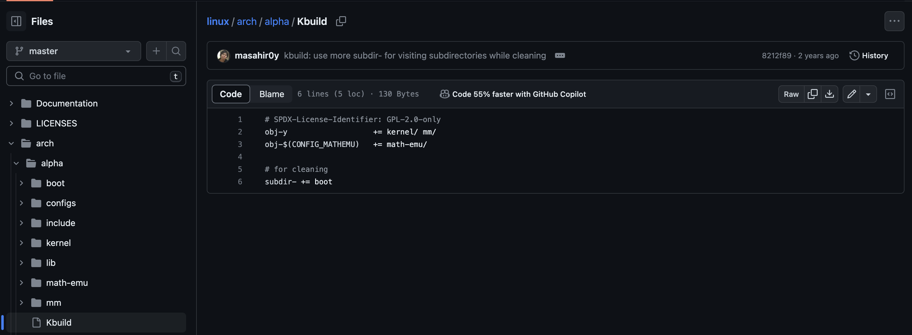  | 代码本身就是一大块文本。 除了代码外，github的主要文本呈现方式为 Markdown + HTML，基本上可以认为是基础的 Markdown 图文，高级一点的包括 HTML 音视频和数据获取等 | Markdown 简易表格                      | Markdown 内联图片，借助HTML能力，广泛支持 SVG、PNG、IMAGE、GIF、Webm等格式 | 借助 HTML内联 media，一般不呈现音频数据 | 借助 HTML内联 media                                |
| 小红书         | 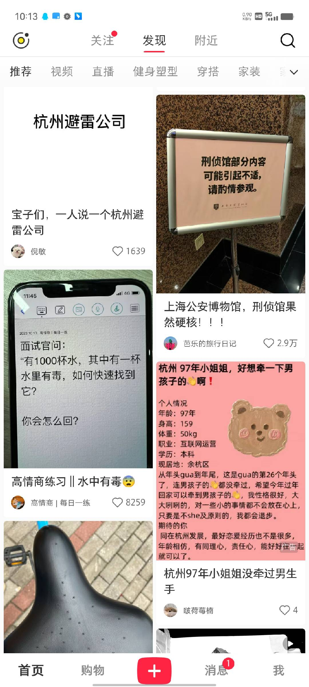 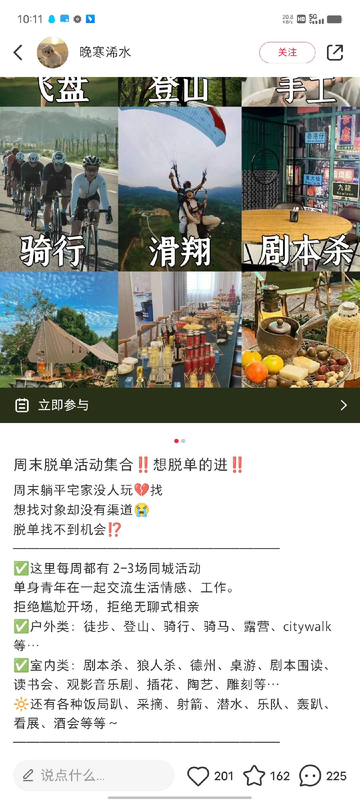            | 小红书是 PlainText，文本基本上是用来辅助图片的。所以即使是纯文本的图片，也是以「图」为媒介出现的。 | PlainText 手打表格                     | 图片作为封面展示，比较契合「小红书」的品牌说法。无论是外头的图片流，还是内部的详情，都是以图片为主的。 | -                                       | 有视频号                                           |
| 公众号         |  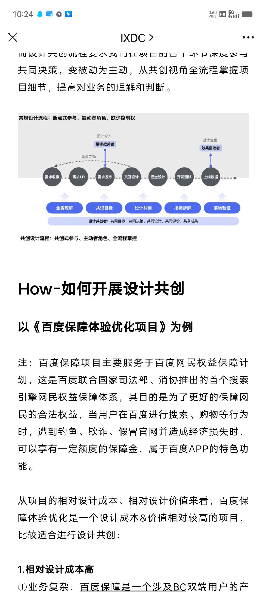      | 公众号是 Embed HTML，内容较多。可以看到，公众号还是重标题，轻图片的 | 较少，基本上以图片呈现的表格为主       | 树状图，基本上公众号也是文字辅助图片的                       | 公众号可以引入音频，作为BGM存在         | 公众号可以引入视频，要么作为文本内嵌，要么独立视频 |
| 知乎           | 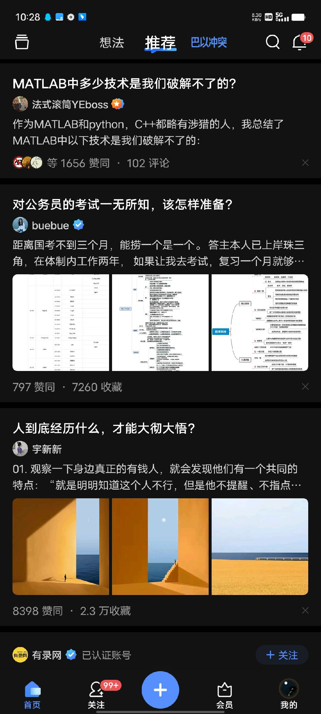 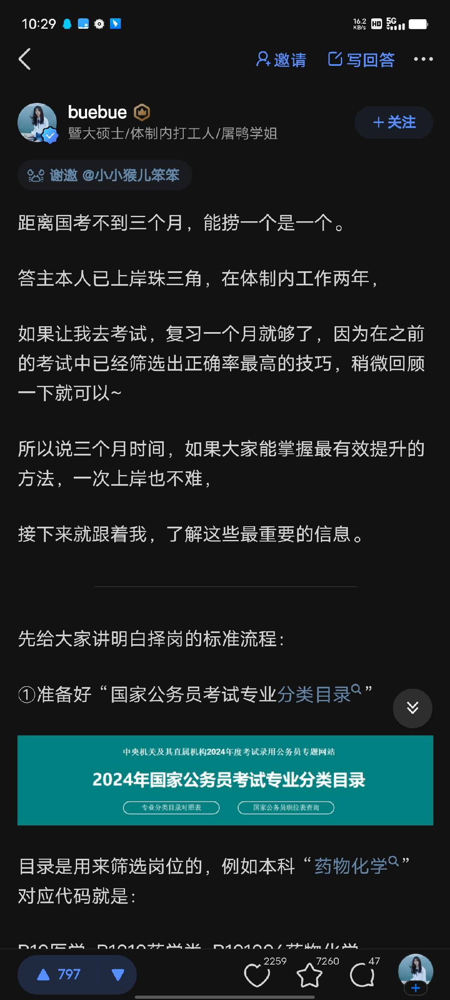        | 知乎也是 Embed HTML，和公众号相同的是，他们都注重文字标题。和公众号不同的是，知乎特别注重标题。 | 和微信一样，以图片呈现居多             | 有很多图片，和微信类似                                       | -                                       | 可以添加视频，也有视频号                           |
| CSDN           | 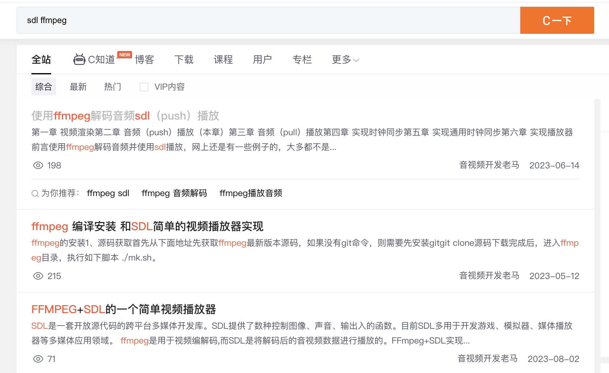   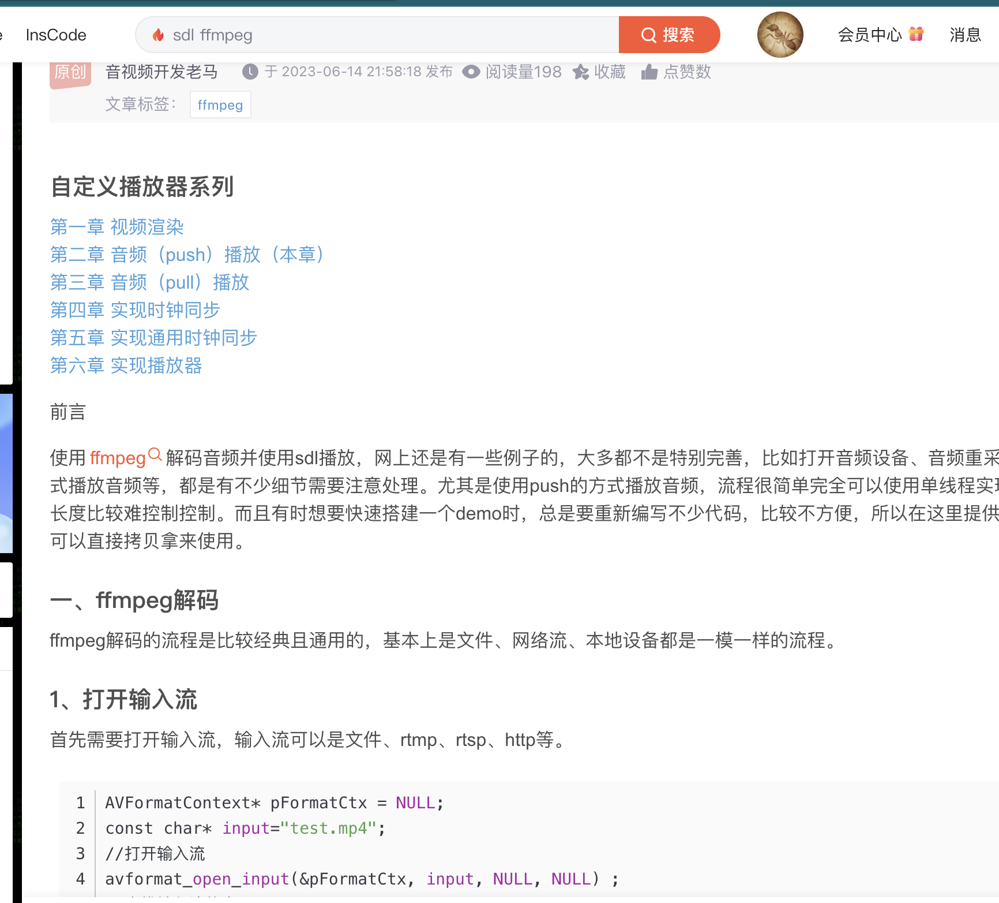     | CSDN如今已经是 Markdown了                                    | 表格略少，Markdown 内联表格 + 图片表格 | Markdown 内联图片                                            | -                                       | -                                                  |
| bilibili       |     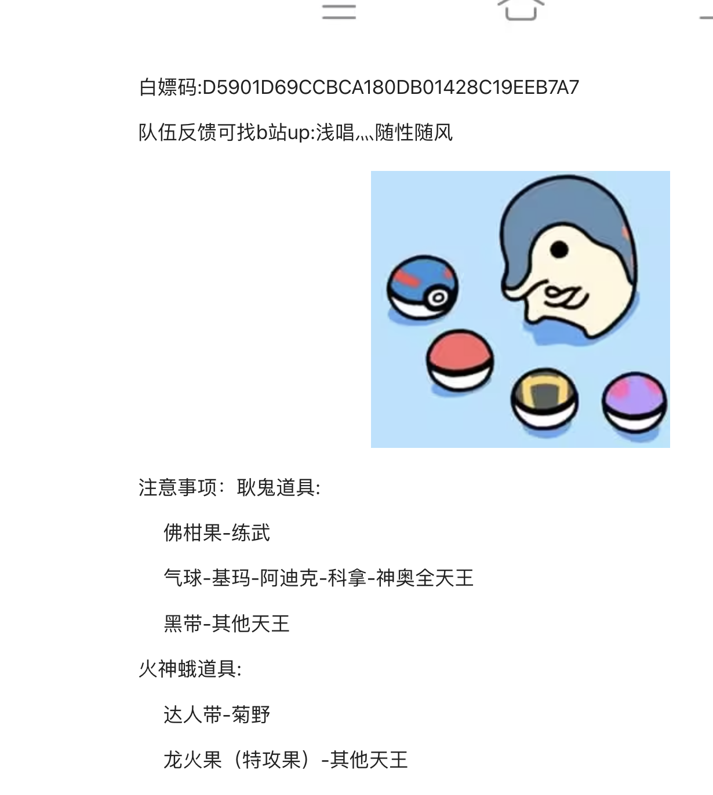 | 视频部分，文字是标题，弹幕、评论以及视频简介这些。主要还是以视频为主要内容。 专栏部分，文字才居多。 | 表格较少，基本上是图片。               | 表情包很多，专栏部分才有图片                                 | -                                       | 长视频为主                                         |
| 微信群         | 略                                                           | 段文字聊天                                                   | -                                      | 表情包和图片都有                                             | 语音聊天                                | 视频链接                                           |
| 朋友圈         | 略                                                           | 文字                                                         | -                                      | 图片，九宫格                                                 | -                                       | 视频号                                             |
| notion         | 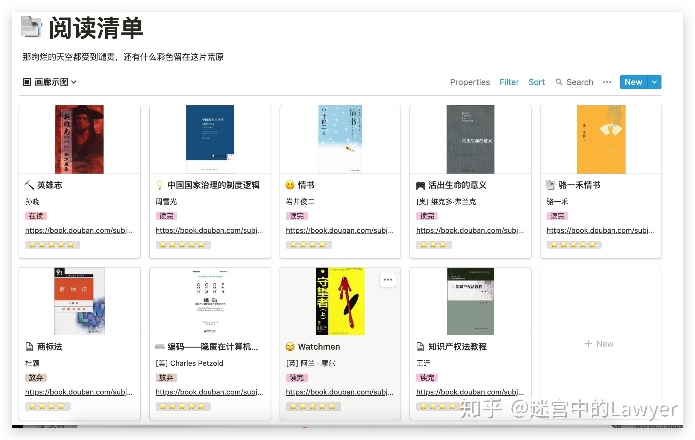                                  | notion的文本格式就是notion，其实是HTML富文本格式。类似markdown有辅助编辑 | 智能表格，表格可以简单纳入各种元素     | HTML 自由图片                                                | HTML Embed 音频                         | HTML Embed  视频                                   |
| 播客（小宇宙） |    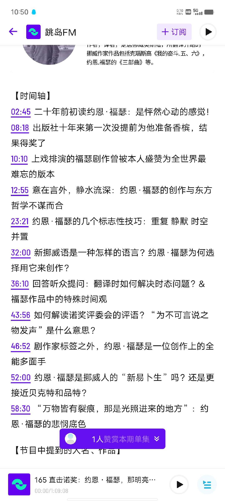          | 和知乎、微信差不多，基本上标题上还是文字为主，内容上，文字就变成音频的辅助了。 | -                        | 嵌入图片，类似微信。                                                     | 一个音频播放器                          | -                                                  |
| 微博           |                                    | 嵌入式文本，基本上就是 plain text                                                  | -                                      | 嵌入图片，九宫格，辅助文本                                             | -                                       | 嵌入视频，辅助文本                                           |
| 虎扑           | 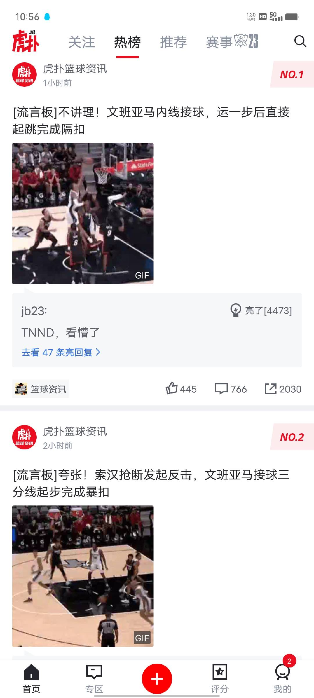           | Embed 文本，基本上是短文本，也有长文。短文本就像是大家朋友圈聊天一样，重视主要内容和陌生人的评论                       | -                                      | 图片辅助文本，长文也是如此                                                     | -                                       | 视频辅助文本，长文也是如此                                           |
| steam          | 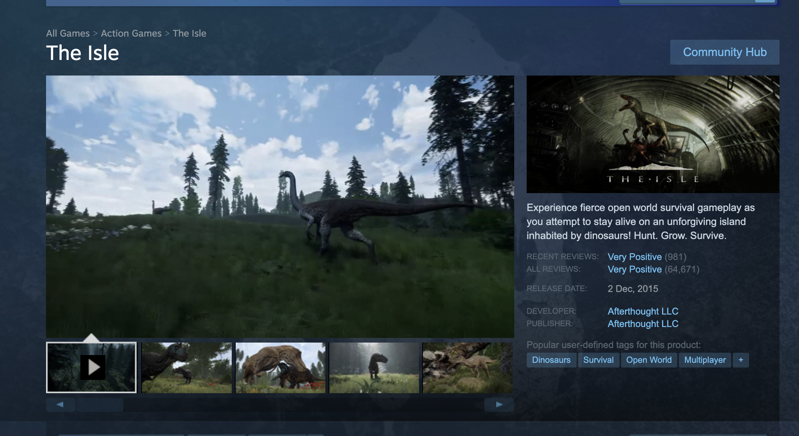                                   | 文本是被模版化的，基本上在游戏介绍中会有特殊形式，但是文本的表现力不强                                                    | -                                      | 图片会显示在游戏介绍，游戏预览和游戏宣传图                                                 | -                                       | 基本上都会有游玩视频                                         |
| 博客网页       |                                                              | 文本是HTML 富文本，基本上是根据不同需求应用不同的文本，比较通用的是Markdown，MD之前则是富文本 | HTML 表格 | HTML 图片 | HTML 媒体 | HTML 媒体 |

### 结构化数据

| 平台     | 文   | 表   | 图   | 音   | 视频 |
| -------- | ---- | ---- | ---- | ---- | ---- |
| github   | ✓    | O    | ✓    | O    | ✓    |
| 小红书   | ✓    | O    | ✓    |      | ✓    |
| 公众号   | ✓    | O    | ✓    | ✓    | ✓    |
| 知乎     | ✓    | O    | ✓    |      | ✓    |
| CSDN     | ✓    | O    | ✓    |      |      |
| bilibili | ✓    | O    | ✓    |      | ✓    |
| 微信群   | ✓    |      | ✓    | ✓    | ✓    |
| notion   | ✓    | ✓    | ✓    | ✓    | ✓    |
| 朋友圈   | ✓    |      | ✓    |      | ✓    |
| 小宇宙   | ✓    | O    | ✓    | ✓    |      |
| 微博     | ✓    |      | ✓    |      | ✓    |
| 虎扑     | ✓    | O    | ✓    |      | ✓    |
| steam    | ✓    | O    | ✓    |      | ✓    |
| 博客     | ✓    | ✓    | ✓    | ✓    | ✓    |

### 平台特征

| 平台     | 特征                                 | 呈现方法                                 | 浏览者模型           |
| -------- | ------------------------------------ | ---------------------------------------- | -------------------- |
| github   | Markdown支持，开源开放，工程化，标准 | 工程化项目化的内容                       | 专业人士             |
| 小红书   | 视觉至上，文本内容支撑               | 图片视觉，感性宣传                       | 创意人士             |
| 公众号   | 内嵌HTML，品牌化                     | 阶段性总结，独立内容呈现                 | 专业、创意人士       |
| 知乎     | 问答式                               | 清晰的逻辑                               | 科研人士             |
| CSDN     | Markdown支持，代码工程等             | 门槛工具使用说明                         | 专业、科研人士       |
| bilibili | 长视频和视频辅助                     | 深度链接 & 产品介绍 & 门槛工具使用说明等 | 专业、学生、创意人士 |
| 微信群   | 短平快数据流                         | 文本公告                                 | -                    |
| notion   | 表格化数据管理                       | 数据库资源呈现                           | 专业、学生、创意人士 |
| 朋友圈   | 短图文                               | 图文公告                                 | -                    |
| 小宇宙   | 音频与音频博客                       | 对话内容的拓展，会议、灵感、口语化       | ？                   |
| 微博     | 短图文                               | 图文公告                                 | -                    |
| 虎扑     | 聊天广场，短图文                     | 诙谐叫卖                                 | 娱乐人士             |
| steam    | 游戏产品                             | 乐趣和挑战                               | 娱乐、挑战人士       |
| 博客     | -                                    | -                                        |                      |

### 可行性分析

| 平台     | 可行性 | 说明                               | 后续工作                                               |
| -------- | ------ | ---------------------------------- | ------------------------------------------------------ |
| github   | ✓      | 技术、设计工程、创意倡议等在此呈现 |                                                        |
| 小红书   | O      | 简单的创意、视觉、活动在此呈现     | 需要开始一定的**视觉设计**工作                         |
| 公众号   | O      | 阶段性的，重要的在此呈现           | 需要有**多媒体资源管理**方法                           |
| 知乎     | O      | 概念性的，强逻辑的在此呈现         | 需要定向学习一些**专业知识**，并尝试找到问题和予以解决 |
| CSDN     | ✓      | 工具性的，在此呈现                 |                                                        |
| bilibili | O      | 视频类的，在此呈现                 | 需要**制作视频**                                       |
| 微信群   |        | 公告性的，在此呈现                 |                                                        |
| notion   | O      | 数据性的，在此呈现                 | 需要**有数据**能开放                                   |
| 朋友圈   | O      | 公告性的，在此呈现                 |                                                        |
| 小宇宙   |        |                                    |                                                        |
| 微博     |        | 公告性的，在此呈现                 |                                                        |
| 虎扑     |        |                                    |                                                        |
| steam    |        |                                    |                                                        |
| 博客     | O      | 综合性的，在此呈现                 | 需要自制网页                                           |

