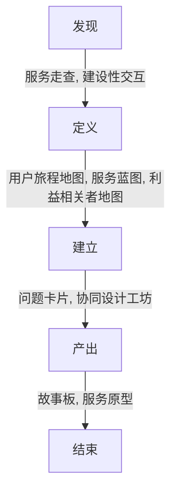

# 什么是设计？

> **Wiki 中文:** 所谓**设计**，即“设想和计划，设想是目的，计划是过程安排”，通常是指有目标和计划的创作行为及活动。
>
> 最简单的关于设计的定义，就是一种有目的的创作行为。同时设计的过程是要经历情报的收集及分析，再将不同的情报筑起一件作品，故设计又可以叫作情报的建筑。
>
> **Wiki 英语:** A **design** is a plan or specification for the construction of an object or system or for the implementation of an activity or process, or the result of that plan or specification in the form of a prototype, product or process.
>
> **说文解字:** “设” 为 “施臣也”，“计” 即 “会算也”，其基本含义是**设想**、**运筹**、**规划**和**计算**。
>
> **论创新设计:** _(P62)_ 设计是人类所有有目标创新实践活动的**先导**和**准备**，是从源头和**供给侧创意**设置目标、引领系统创新集成、保障目标顺利实现的关键。任何有目标的创新实践活动在实施之前必定先有**设想策划**、**规划算计**，否则实践活动就可能是盲目的。
>
> _(P96)_ 设计是实现应用**价值的发明创造**和应用创新过程。

我认为，设计是人类实现目标的过程中，能动的搜集环境中的信息，对信息进行搜集，整理，筛选，加工，再搜集，再整理，再筛选，再加工，以产出新信息，用以指导人类如何更好的实现目标，是一个不断前进，螺旋上升的过程。

# 什么是创新设计？

>  **论创新设计:** _()_ 创新设计面向**知识网络时代**，以产业为主要服务对象，具有绿色低碳、网络智能、开放融合、共创共享等特征，集科学技术、文化艺术、服务模式创新与一体，是科技成果转化为现实生产力的关键环节，引领新一轮产业革命发展。
>
> _(P110)_ 创新设计本身的立意涵盖面是大设计。
>
> 创新设计是人类文明进步与时代变化的要求。
>
> 创新设计是我国实现创新驱动发展战略的必然要求。
>
> 创新设计是实现“三个转变”的重要要求。
>
> 创新设计是把握全球产业革命机遇的迫切要求。

我认为，创新设计是设计的发展，它象征了当代设计需要新的信息，需要新的信息收集、新的整理方式、新的筛选模式以及新的加工方法，以产出更新的想法。在当代，中国发展买入新时代，新的技术在新的时代背景下，新的通信技术——5G，新的数据存储方式——大数据存储，新的数据处理方式——人工智能，新的技术犹如催化剂，它们可以在各个领域焕发生机，推动各个领域进一步发展，而这一系列的创新内容，都需要由我们“新一代”通过“创新设计”去设计，去实现。

- 落后就要挨打，当今世界并不太平，我们必须把握全球产业革命的机遇，使用创新设计发展综合国力，应对当前国际社会各种不确定性。因此发展创新设计是必要且紧迫的。
- 国家发展需要新动力，而创新设计又是创新驱动发展的必然要求。将创新设计作为燃料，推动各行各业转型发展，这个任务是必要且紧迫的。
- 创新设计可以全面融入国家“三个转变”，使用创新设计推动中国制造向中国创造转变，创造新内容。使用创新设计重组供给侧资源，就可以在保证中国速度的前提下发展中国质量。使用创新设计打造中国品牌。都是必要且紧迫的。
- 创新设计是人类文明进步与时代变化的要求。人民对美好生活的需要在不断提高，通过创新设计重组传统文化，重新整理当下生活，从而使传统文化在当下产生新的生机，使当下的生活可以更好的提供、满足人民的需要。

# 思考为什么发展创新设计是必要且紧迫的，尝试从多个方面展开说说看

# 什么是工业设计?

> **IDSA (美国工业设计师协会) 定义:** 以优化产品性能、价值和外观，是以提高厂商和顾客共同利益为目标而进行的产品新概念创立与开发方面的专业服务。
>
> **2015 年 国际设计组织:** 一种将策略性解决问题的过程应用与产品、系统、服务以及体验的设计活动。
>
> **2017 年 国际设计组织:** 工业设计是驱动创新、成就商业成功的战略性解决问题的过程。通过创新性的产品、系统、服务和体验创造更美好的生活品质。
>
> **Wiki 中文(1):** 工业设计是以工学、美学、经济学为基础对工业产品进行的设计。它是 20 世纪初工业化的产物，其设计理念从产生之初的“形式随机能”，发展到现今的“在符合个方面需求的基础上兼具特色”。随着以机械化为特征的工业社会向以信息化为特色的知识社会迈进，工业设计以用户参与、以用户为中心为关键词，并展现出未来设计的趋势。
>
> **Wiki 中文(2):** 工业设计是对工业产品的使用方式、人机关系、外观造型等做设计和定义的过错。
>
> 工业设计就是对工业产品的使用方式、人机关系、外观造型等做设计和定义的过程。他将产品的功能通过有型的方式创造性的体现，使得工业产品和人的适当的、高效的，甚至有情感的交流得以实现。他是一种产品与人沟通的语言，是工业产品和人之间的重要纽带，是用户体验的决定性组成部分。
>
> 1901年工业设计先祖WALTER GROPIUS，在德国魏玛地方创设包豪斯机构从事现代化的改革之后，世界各国纷纷藉蒸汽机及发动机的力量创造人类生活用品，为达其原先立意“自由”、“平等”、“博爱”的宗旨，改变以往帝王式的华丽唯美之模式，揭举三大改革方向：
>
> 1. 改变传统造形；
> 2. 改变制造的素材；
> 3. 改变生产方式，也就是今日所谓的“量产”（MASS PRODUCTION），模式大都以机械力取代人力，以达人人能消费得起。
>
> 1970年国际工业设计协会ICSID（**I**nternational **C**ouncil of **S**ocieties of **I**ndustrial **D**esign）为工业设计下了一个完整的定义：“工业设计，是一种根据产业状况以决定制作物品之适应特质的创造活动。适应物品特质，不单指物品的结构，而是兼顾使用者和生产者双方的观点，使抽象的概念系统化，完成统一而具体化的物品形象，意即着眼于根本的结构与机能间的相互关系，其根据工业生产的条件扩大了人类环境的局面。”
>
> 1980年国际工业设计协会理事会（ICSID）给工业设计更新的定义：“就批量生产的工业产品而言，凭借训练、技术知识、经验及视觉感受，而赋予材料、结构、构造、形态、色彩、表面加工、装饰以新的品质和规格，叫做工业设计。根据当时的具体情况，工业设计师应当在上述工业产品全部侧面或其中几个方面进行工作，而且，当需要工业设计师对包装、宣传、展示、市场开发等问题的解决付出自己的技术知识和经验以及视觉评价能力时，这也属于工业设计的范畴。”
>
> 2006年国际工业设计协会理事会（ICSID）给工业设计又作了如下的定义：设计是一种创造活动，其目的是确立产品多向度的品质、过程、服务及其整个生命周期系统，因此，设计是科技人性化创新的核心因素，也是文化与经济交流至关重要的因素。
>
> 任务：设计在于对结构、组织、功能、表达和经济关系的发现和评估，其任务是：
>
> - 增强全球可持续化发展和对环境的保护（全球道义）
> - 赋予人类社会整体，个人与集体的利益与自由
> - 决定用户，生产者和市场领导者（社会道义）
> - 不论世界如何全球化，支援文化多样性（文化道义）
> - 赋予产品、服务和系统与其特性在形式（符号的、语义学）的表达并与它们的内涵相协调（审美的、美学）一致。
>
> 设计涉及产品、服务、系统在工业化导入下与工具，组织和逻辑的构想，——不仅仅是因为系列过程所产生。将设计冠以“工业的（industrial）”形容词，必须与“产业（industry）”的术语或制造的意义、或“工业化行为（industrious activity）”的传统意义有关。因此，设计是一种涉及众多专业的广泛频谱，其范围包括了产品、服务、平面、室内、建筑等所有相关领域。这些活动应该以协和的方式与其他专业团队合作——进一步提升生命的价值。因此，设计师一词涉及到以智慧专业方式实践的个体，而不简单的是为商业或服务业的企业。
>
> 2015年在第29届大会公布的工业设计新定义如下： “工业设计是一个策略性解决问题的过程，推动创新，建立企业的成功，借由创新的产品，系统，服务和体验,进而增进更好的生活品质。”
>
> 这定义的一个扩大解释如下： “工业设计是一个策略性解决问题的过程，推动创新，建立企业的成功，借由创新的产品，系统，服务和体验,进而增进更好的生活品质。 它是一个跨学科的专业桥梁，运用创造性解决问题，展现于产品，系统，服务，体验或企业使之获得更好的解决方案得到更好的结果 它的核心提供了着眼于未来更乐观的方式,共同打造的解决方案，透过重新定义问题找出机会。链接创新，技术，研究，企业和客户提供跨越经济，社会和环境领域新的价值和竞争优势。 工业设计师以人为中心的设计过程。获得使用者的深刻理解需要通过同情和应用务实的，以使用者为中心的解决问题的过程来设计产品，系统，服务和体验。 在创新过程中的运用相关策略并具有独特的优势弥补不同的专业学科和商业利益。设计师亦创造出经济，社会和环境的价值以及对一个更好的生活品质作出贡献。”

# 什么是服务设计?

> 服务设计是为了提高服务质量和优化服务提供者与客户之间的交互，对服务的人员、基础设施、信息沟通和材料组成部分进行规划和组织的活动。服务设计既可以是对现有的服务进行更改，也可以是创建全新的服务方式。
>
> 服务设计是一种设计方式，人与人一起创造与改善服务体验。这些体验随着时间的推移发生在不同接触点上。它强调合作以使得共同创造成为可能，让服务变得更加有用、可用、高效、有效和被需要。
>
> **Wiki 中文:** 服务设计是针对服务的设计，其整合了**服务科学**中的方法论，针对服务的**服务提供者**与**服务消费者**，为了解决“如何有效的提供更好的服务”而产生的设计过程。[服务科学](https://researcher.watson.ibm.com/researcher/view_group.php?id=1230)
>
> **Wiki 英文:** **Service design** is the activity of planning and arranging people, infrastructure, communication and material components of a service in order to improve its quality, and the interaction between the service provider and its users. Service design may function as a way to inform changes to an existing service or create a new service entirely.
>
> The purpose of service design methodologies is to establish the most effective practices for designing services, according to both the needs of users and the competencies and capabilities of service providers. If a successful method of service design is adapted then the service will be user-friendly and relevant to the users, while being sustainable and competitive for the service provider. 
>
> Service design practice is the specification and construction of processes which deliver valuable capacities for action to a particular user. Service design practice can be both tangible and intangible, and can involve artefacts or other elements such as communication, environment and behaviour. Several of the authors of service design theory including Pierre Eiglier, Richard Normann, Nicola Morelli, propose that services come to existence at the same moment they are both provided and *used*. In contrast, products are created and "exist" before being purchased and used.
>
> **《触点-服务设计的全球语境》:** 随着信息技术的发展和信息交互设计的崛起，体验经济和体验设计取得了快速的发展。当代设计强调，用户目标就是企业和组织的目标。为此，美国商学院流行着这样一句话——Design is business，这阐明了设计与创新在当代商业和社会中的地位。利益 (Benefit)、体验 (Experience)、效率 (Efficiency)，三者构成了描述设计目标的三个重要指标，至此服务设计的概念也随之浮现。
>
> 服务设计体现出强烈的过程体验特征，使得很多人将体验设计和交互设计理解为服务设计，对服务设计认识得不全面。服务设计很难用一句话描述清楚，它是一个整合的系统，是一种模式 (服务模式, Service model)。服务设计师常常从以下几个方面来描述服务系统:  服务的价值网络、用户的体验路径、服务系统和模式、服务蓝图、服务触点。服务模式的实现需要靠有效的组织来实现，具体体现为组织的商业模式，基于服务模式的商业模式是服务战略实施的路径。因此，服务设计是从服务模式创新到商业模式创新的必经之路。

我认为，服务设计及服务+设计，它是一种针对服务场景，对服务过程中的服务提供者、服务接受者在服务环境下的服务流程设计。

# 什么是交互设计?

> 交互设计是定义、设计人造系统的行为的一种设计领域。它定义了两个或多个互动个体之间交流的内容和结构，使之相互配合，共同达成某种目的。它努力创造和建立的是用户与产品及服务之间有意义的关系。以”在充满社会复杂性的物质世界嵌入信息技术“为中心，关注以人为本的以洪湖需求。
>
> **Wiki English:** **Interaction design**, often abbreviated as **IxD**, is "the practice of designing interactive digital products, environments, systems, and services." Beyond the digital aspect, interaction design is also useful when creating physical (non-digital) products, exploring how a user might interact with it. Common topics of interaction design include design, human–computer interaction, and software development. While interaction design has an interest in form (similar to other design fields), its main area of focus rests on behavior. Rather than analyzing how things are, interaction design synthesizes and imagines things as they could be. This element of interaction design is what characterizes IxD as a design field as opposed to a science or engineering field.

工业设计的诞生与发展都比交互设计要早，两者都以“用户为中心”为基本思想，在设计方法上有许多相似之处。工业设计以产品功能为基础，优化产品使用效率，美化产品外形，改善用户体验。因此，工业设计多会在产品外形、材料、功能上下功夫。而交互设计的产生，是由于智能手机这种多功能产品出现而发展起来的，它在充满复杂性的物质世界中嵌入信息技术，思考信息技术如何与人协作，思考人与信息产品的输入输出等一系列事件交互，从而设计更有效、易学、易用且安全的产品。

