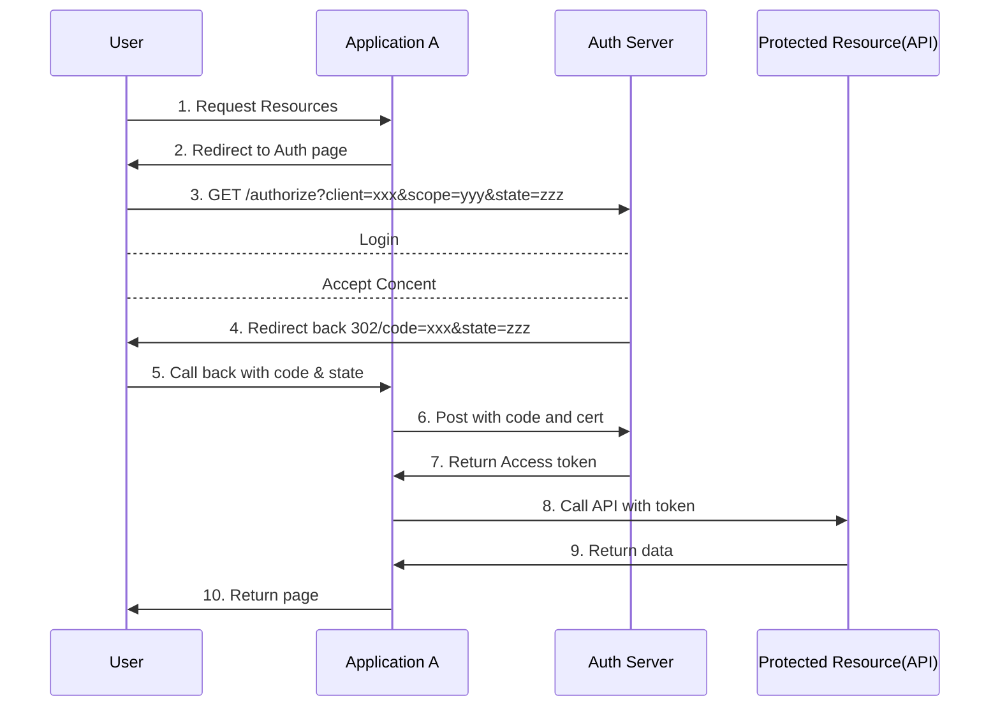
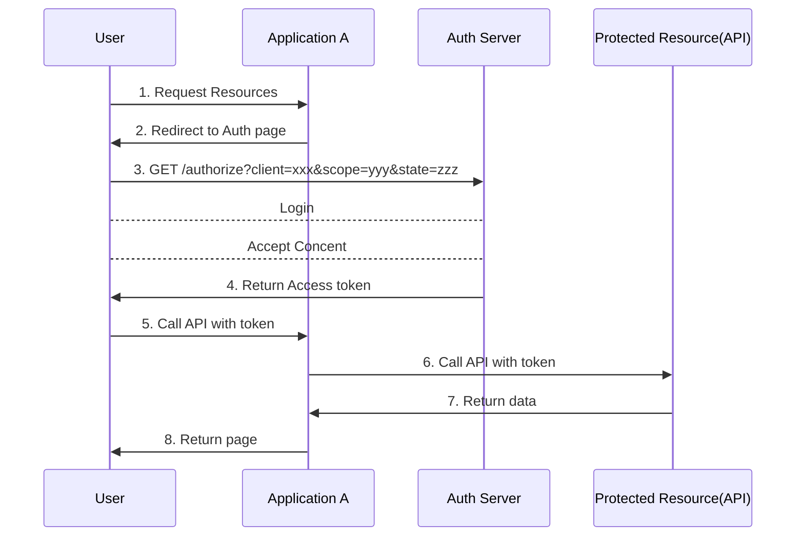

> 参考文章：
>
> - [什么是SSO？](https://blog.csdn.net/huahan6081/article/details/92593120?ops_request_misc=&request_id=&biz_id=102&utm_term=SSO&utm_medium=distribute.pc_search_result.none-task-blog-2~all~sobaiduweb~default-0-92593120.142^v75^insert_down38,201^v4^add_ask,239^v2^insert_chatgpt&spm=1018.2226.3001.4187)：SSO（Single Sign On）
> - [【IT老齐241】SSO、CAS、OAuth、OIDC到底有啥区别？](https://www.bilibili.com/video/BV1XG411w7DN/?spm_id_from=333.337.search-card.all.click&vd_source=b736aa3d7f0fdf47b59ea3021dc810ab)：按照老齐的意思，就是说，OAuth是一种授权协议，而OpenID（OIDC）是一种包含了 OAuth 的认证协议。
> - [OAuth2.0 + OIDC + Identity Server4 + Azure AD +Application development](https://www.bilibili.com/video/BV12v411r776/?spm_id_from=333.337.search-card.all.click&vd_source=b736aa3d7f0fdf47b59ea3021dc810ab)：干货视频
> - IdentityServer4

# 网络服务认证

根据网上的说法，SSO是一种概念，单点授权后，所有的应用都可以过认证。

而OAuth只提供授权，OIDC在OAuth的基础上，提供了认证和授权。

## Authorization Code 交互流程

## Implicit 流程（不安全，推荐 PKCE）

## 专业名词

- 授权问题：如何让应用有限的访问服务资源（OAuth2）
- 认证问题：如何让应用有限的知道我是谁（OpenID）
- 授权服务器（Identity Provider）：需要被大家信任，微信、Google、微博等
  - User Identity info
  - Application info
  - API info
- Access Token：权限令牌（被签名加密过的）
  - Google：未知解析
  - 微软：JWT（Json Web based Token）BASE64编码
    - Header
    - Payload
    - Signature（非对称加密）
- Refresh Token
- ID Token：让应用获取用户信息
- Grant Type（授权类型）
  - Authorization Code
  - Client Credentials（后台任务使用）
  - Implicit（简化，不推荐）
  - Resource Owner Password Credentials（不推荐）
  - Device Code
  - Refresh Token
- Endpoints
  - Discovery Endpoint：服务器资源端点
  - Authorize Endpoint：认证端点
  - Token Endpoint：换取真正的 access token
  - User Info Endpoint： 获取用户信息
  - Revocation Endpoint：撤销 token
  - End Session Endpoint：登出
  - Device Authorization Endpoint：设备