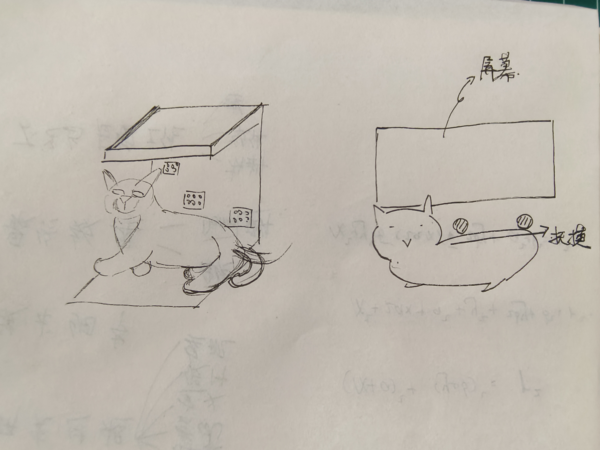

# 高爷家 脑爆

## 确定方向方案：《今天吃什么》

**目的**：为了让用户感受到流浪猫会吃到许多垃圾食品而患病

**优点**：好做、信息化、优良的交互性和代入感，能产生共情

**初始方向**：用老虎机的形式来展示猫一天可能会吃到哪些食物

## 方向问题总结

大问题：

- 装置的目标客户可能有哪些？
- 装置的体量有多大？
- 装置的使用场景可能有哪些？
- 怎样和去年的活动形成延伸？
  - 如何往内部添加Slogan信息
- 装置内展示的猫长什么样？
- 装置如何和用户产生共情？
- 装置如何做流量引爆？

细节问题：

- 用户如何收取老虎机的奖励？
- 怎么代入流浪猫的视角？
- 装置长啥样？
- 如何让它更吸引眼球？
- 除了「老虎机」还能是什么？
- 如何表达具体的游戏形式？
- 怎样表现流浪猫？
- 有没有可能是移动的？
- 输入方式是什么？
  - 杆在哪儿？
- 产出（猫粮）与整体装置的关系是什么？
  - 垃圾与产出的关系是什么？
- 产出内容会不会因为同质化而无吸引力？
- 游戏想表达的意义是什么？
- 游戏是否不是一个适合叙述的手段？
- ~~有无别的形式让人更能代入猫的视角？~~
  - 如何让人能代入猫的视角？
- 如何吸引人？

**问题转译**

> 装置的目标客户可能有哪些？
>
> 装置的使用场景可能有哪些？
>
> 装置如何和用户产生共情？

1. 谁，在什么样的场景下，从我们的装置中，联想到了什么内容？

> 装置的体量有多大？
>
> 装置内展示的猫长什么样？
>
> 装置长啥样？
>
> 除了「老虎机」还能是什么？
>
> 有没有可能是移动的？

2. 装置具体样式？

> 用户如何收取老虎机的奖励？
>
> 如何表达具体的游戏形式？
>
> 输入方式是什么？
>
> - 杆在哪儿？
>
> 用户是如何获取装置的产出物的？

3. 装置的游戏性机制是怎样设计的？

> 怎么代入流浪猫的视角？
>
> 如何让它更吸引眼球？
>
> 如何吸引人？
>
> ~~有无别的形式让人更能代入猫的视角？~~
>
> - 如何让人能代入猫的视角？

4. 如何让这个装置成为优秀的，有价值，有吸引力的，好的「艺术装置」？

> 怎样表现流浪猫？
>
> 产出（猫粮）与整体装置的关系是什么？
>
> - 垃圾与产出的关系是什么？
>
> 游戏想表达的意义是什么？

5. 产品的叙事内核是什么？

> 怎样和去年的活动形成延伸？
>
> - 如何往内部添加Slogan信息
>
> 装置如何做流量引爆？
>
> 产出内容会不会因为同质化而无吸引力？
>
> 游戏是否不是一个适合叙述的手段？

6. 如何让它成为「历史」价值品，成为「文化」价值品？

## 设计背景

社会经济高速发展，网络与工作在不断地拉扯我们的现实和生活。越来越多的人在网络上人际丰满，在现实中社交惨淡，养猫成为了长久陪伴的Plan。当然，并不是所有的人都会选择养猫，养猫过程中的种种问题如除虫、去猫、铲屎等，都是一部分人拒绝家养养猫的理由。除了上面的原因，经济能力不足、生活区域变迁等也是导致许多人弃养猫的原因。有研究显示，33%的流浪猫由领养者遗弃。

流浪猫在人类的视线中出现的逐渐频繁。不少学生、孩童们一方面喜爱这些毛茸茸可爱的精灵，另一方面，家长们也会对野猫进行投喂从而为孩子们建立一个「爱护生命」的教育行为。然而，经权威研究验证，流浪猫种群的扩大，比较严重的影响到了生态环境。

从食物链上看，城市流浪猫属于次级消费者，鸟类鼠类等属于初级消费者。在城市环境中，许多流浪猫因为缺少顶级掠食者的存在，其寿命较长，种群增长也较快，这导致了许多初级消费者种群数量的下降，也因此破坏了生态系统。

不少研究者表示，可以将流浪猫进行收容，或者绝育领养，再不济也恳求大家不要对流浪猫进行投喂。

## 客户需求

高爷家是一个由爱猫群体组成的一个高品质猫粮品牌。他们希望能够通过一些社会公益性设计的线下营销活动，在增加企业曝光度的同时，更能让人们关注到流浪猫这个群体，为未来帮助流浪猫与人与自然和谐生存提供可能的解决方案。

## 用户画像

小白是一位生活在上海的女学生，校园里有许多猫，她们时常可以看到那些猫躺在地上，躺在电动车上，躺在草地上，翻着肚皮晒着太阳。那憨憨享受的样子特别可爱。小白和她的朋友们在上课前后，只要遇到猫了都会上前用食物挑逗。

小黑是一位生活在北京的中产阶级男性，他自己家养有一只猫，他对猫有比较深入的了解，因此他对他的猫进行了绝育，同时也不会主动的去投喂流浪猫。

小黄是一位社区大妈，她平时爱在家里搞搞卫生，出门散散步走走路。因为爱干净，所以不爱养猫。但还是会对这些动物们带有好奇心，之前侄子来家里玩，对门口的猫感兴趣，小黄就从家里带了些食物出来给侄子喂猫。

# 方案设计 ——《今天吃什么》

## 计划解决的问题

无论是学生还是打工人，他们都只拥有部分闲暇时间去拥抱生活中的点滴温暖(?)。投喂流浪猫成为他们感受爱的一种方式。然而，缺少对流浪猫群体的理解，缺少对流浪猫群体危害的认识，使得本身充满爱心的行为，可能会成为一种不可持续的破坏自然的行为。

我们希望通过一个交互装置，从食物的角度，让人们能够理解流浪猫的生活——一方面因为缺少食物，它们会选择捕猎，杀害自然中的一些鸟类；另一方面也因为缺少食物，它们也会选择进食一些不太卫生的食物。从而在满足他们爱的同时，能够引导他们往更适合自然的方向努力。

## 游戏性设计

游戏过程是一个具有强反馈的交互性学习环境。玩家可以明确的从游戏中简单的元素和它们之间的关系，快速了解其中的知识内容。如游戏《新露谷物语》中，玩家可以学会「犁地-播种-浇水-收割-加工」等等农业技巧。

## 装置外形

## 用户体验流程

|      | 发现                                 | 交互                                                         | 反馈                                                         | 引流                                                         |
| ---- | ------------------------------------ | ------------------------------------------------------------ | ------------------------------------------------------------ | ------------------------------------------------------------ |
| 用户 | 看见有一只猫在睡觉                   | 对猫进行抚摸                                                 | 从屏幕上看见猫在想今天吃什么，看见了猫早中晚的食物           | 引发人群思考，引流至以高爷家为品牌的关于流浪猫的署名文章。   |
| 内容 | 一只猫躺在舒服的**垫子上（？）**睡觉 | 猫的背部是开放的，容易抚摸的。同时也有屏幕上的信息提示用户可以抚摸。 | 用户抚摸感受到了猫毛的柔顺，和猫的体温。此时，屏幕开始播放动画，展现猫在思考今天的食物。此时用户一方面可以继续抚摸猫，另一方面也被屏幕内容吸引，老虎机形式的内容随机滚动，最终用户会看到许多意料之外的食物——如鸟类、含沙的肉等。 | 最终提出终极目标——《除了投喂，我们还能做更多》贴出二维码，让用户进一步了解。 |

## 技术实现

装置首先是一个内置加温装置的猫模型。另外，在背部抚摸的位置有添加超声波传感器，以检测用户对猫的抚摸行为。另外，GUI也搭载在以树莓派为主的嵌入式平台上。降低装置体积，同时也能支持高画质的呈现。

# 不足与反思

**01 谁，在什么样的场景下，从我们的装置中，联想到了什么内容？**

此装置可以放置在高爷家猫粮自动售卖机旁，作为引流物。无论是因为想要购买猫粮而关注到它的用户群也好，或者是对猫本身感兴趣的人也好，都会成为目标客户。

这些对装置产生好奇的用户，会在系统的引导下去抚摸猫，通过屏幕反馈的信息进一步对猫进行同理行为，最终会了解到猫进食其他生物这一原本并不清晰的行为。最终会引发用户反思。

**02 装置具体样式？**

装置的体量可大可小，几乎保持在一只猫的大小。展示的猫种类可以比较丰富，这里设计打算使用生活中比较常见的狸花猫作为式样。装置实际上是一个「撸猫模拟器」的同时，也加上了「今天吃什么」这一从猫视角出发的游戏性内容，最终引流向互联网形成反思——解决方案的闭环。

**03 装置的游戏性机制是怎样设计的？**

老虎机的奖励这里并没有设计。或者说用户对撸猫的行为的满意程度就是这个装置的奖励。游戏形式依旧采用「抚摸」触发，并以「老虎机」形式呈现。老虎机是一种随机呈现的媒介——它里面自然包含有用户期待的「奖励」，也有用户不期待的「垃圾」，借此我们也想表达猫的食物，一部分是我们期望的「猫粮」，也有一部分是我们不期望的「垃圾」，如鸟类，或者根本就是垃圾。

老虎机游戏的触发方式由抚摸替换拉杆，避免游戏性大于体验性。我们认为所有喜爱猫的人士内心都是充满爱的。

**04 如何让这个装置成为优秀的，有价值，有吸引力的，好的「艺术装置」？**

比较重要的还是用户可以通过这个「撸猫装置」感受到什么，用户是否可以明白「猫在想吃什么」这个点。一方面，猫的拟真程度会直接影响用户抚摸的真实性，以及体验的舒适度。另一方面只有猫模型足够优秀，才能与后面——猫吃了我们不愿意它吃的内容，这一观点性的冲突。所以内容重点，一方面是猫模型的设计上，另一方面是游戏反馈的视觉传达要做好。

**05 产品的叙事内核是什么？**

产品的叙事内核其实是想让大家知道——流浪猫在给予人类社会爱的同时，也会猎杀许多鸟类，破坏生态。装置实际上并不产出猫粮，或者只是在「猫想吃什么」的呈现中，可以作为一个选项出现。我们希望让人更理解流浪猫和我们所做的行为——我们喜爱猫，投喂猫的行为作为个体确实是充满爱心的行为，只是也确实流浪猫对生态造成了比较严重的影响，这时候，如果我们真的仍然怀有爱心去爱我们的猫，去爱我们的自然社会，我们就应该去寻找其他办法——比如收容猫，为猫做绝育等，来帮助猫，也来帮助自然，帮助社会。

**06 如何让它成为「历史」价值品，成为「文化」价值品？**

去年的猫粮获取，和让人们关注到流浪猫本身是一件有意义的事情。如果去年让我们关注到了流浪猫的存在，那么今年可能进一步理解流浪猫吃什么，也能算是一种延续。

我觉得装置想要表达的东西还是比较局限，装置更应该被社会去解读，去理解。我们想表达的内容也是充满东方哲学的——并不是非黑即白的，而是一种大同，一种和谐。我相信中国人有能力理解这一内核。

流量引爆的事情只能顺其自然。如果想要曝光度高的话，我们觉得需要在模型上更下功夫。做好我们的产品，讲好我们的故事，自然就是历史，就是文化。
